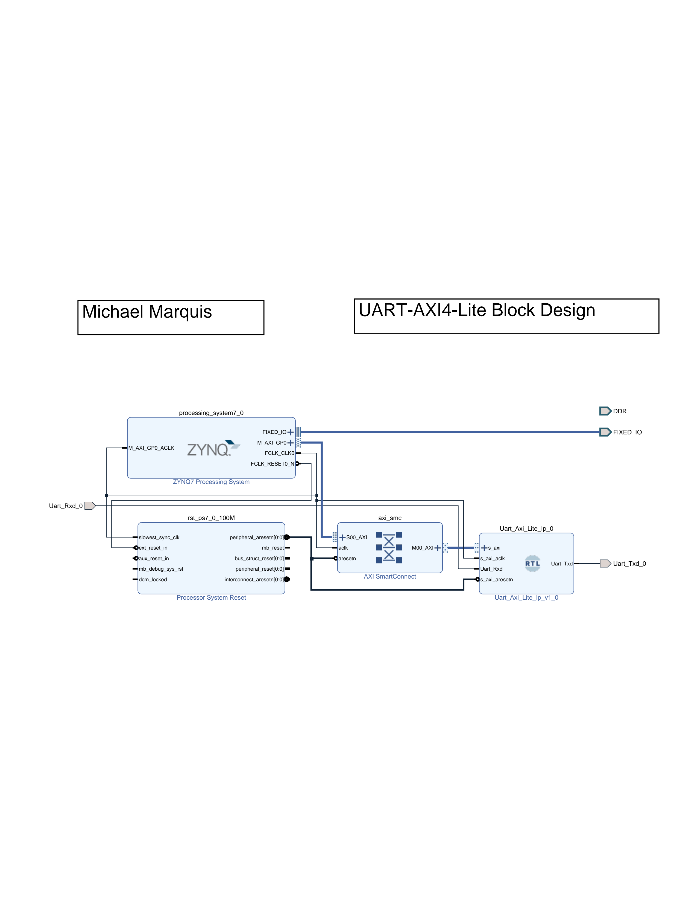
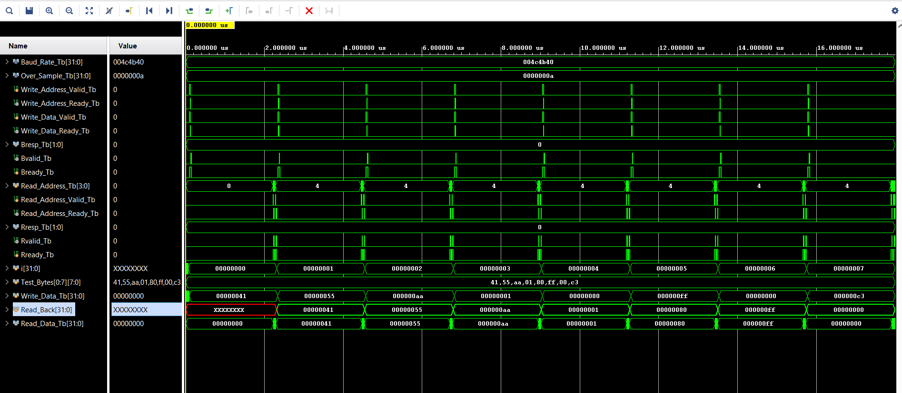

# axi-uart

A UART with independent transmit and receive datapaths, each with its own 16-byte
FIFO with an AXI4-Lite slave interface. A CPU is able to drive it with
register reads and writes. Written in Verilog with no vendor IP, so the TX and RX
blocks also work on their own.

Target part is the Xilinx Zynq-7000 **XC7Z007S**. Verified end to end in
simulation. Then built into a Zynq block design and run on the board with the
processor driving it over AXI.

## Project Overview

The UART is parameterizable. Clock frequency, baud rate and oversampling factor
are module parameters, so retargeting to a different clock or line rate is a
parameter override instead of a code change.

Everything the CPU needs sits behind four 32-bit registers. Write a byte to send
it, read a byte to pull one out, and check status for FIFO state and errors.

```
CPU  <--AXI4-Lite-->  register block  -->  TX FIFO --> TX FSM --> Uart_Txd
                                      <--  RX FIFO <-- RX FSM <-- Uart_Rxd
```

## Architecture & Design

**Transmitter** [rtl/uart_tx.v](rtl/uart_tx.v)
- Four state FSM: Idle, Start, Data, Stop. 8N1 framing.
- Baud counter is held at zero while the line is idle, so the first bit period
  lines up with the start of the frame instead of wherever a free running counter
  happened to be.
- 16-byte FIFO in front of the FSM. The FSM pops a byte whenever it goes idle and
  the FIFO is not empty.
- Line idles high, reset is active low.

**Receiver** [rtl/uart_rx.v](rtl/uart_rx.v)
- Two flip flop synchronizer on the incoming line before anything else looks at it.
- 16x oversampling. The FSM finds the start bit, waits half a bit to get to the
  middle, then samples every 16 ticks from there so it reads each bit at its center.
- Re-checks the start bit at mid-bit and returns to idle if it went high, which
  throws out glitches.
- Flags a frame error if the stop bit is not high, and drops that byte instead of
  pushing it into the FIFO.
- Flags an overrun if a byte arrives with the FIFO already full.

**FIFOs**
- 16 deep, 8 bits wide, one per direction. Depth is a parameter with a
  power of two check at elaboration.
- Pointers carry one extra MSB so full and empty are distinguishable when the
  pointers otherwise match.
- The RX FIFO read output is combinational (first word fall through), so the AXI
  read can return the head byte and pop the FIFO on the same cycle.
- Storage is written from a clocked block with no reset. The pointers determine
  which slots are valid, so unread slots are unreachable and there is nothing to
  clear. Keeping an async reset off the array is also what lets it infer as memory.

**AXI4-Lite interface** [rtl/uart_axil.v](rtl/uart_axil.v)
- Full AW/W/B and AR/R channel handshaking.
- Write address and write data are both latched at their handshakes. The register
  decode uses the latched copies, so a master that drops the address after AWREADY
  and sends the data later still writes the right register.
- The status register is combinational, so a read always returns live hardware
  state rather than something stale.

**Block design wrapper** [rtl/uart_axil_ip.v](rtl/uart_axil_ip.v)
- Renames the interface ports to the AXI spec names (`s_axi_awaddr`,
  `s_axi_awvalid` and so on) so Vivado's IP Integrator recognizes the bus and can
  connect it to the Zynq PS automatically.
- Pure renaming, no logic. The core underneath is untouched, which is why all four
  testbenches still run against it unchanged.

### Register map

| Offset | Name | Access | Description |
|---|---|---|---|
| `0x0` | TX_DATA | W | Byte in `[7:0]` is pushed into the TX FIFO |
| `0x4` | RX_DATA | R | Returns head of RX FIFO in `[7:0]` and pops it |
| `0x8` | STATUS | R | Live status, see below |
| `0xC` | CONTROL | R/W | General purpose control register |

STATUS bits:

| Bits | Field |
|---|---|
| 0 | TX busy |
| 1 | RX data ready |
| 2 | Frame error |
| 3 | Reserved |
| 4 | Overrun error |
| 5 | TX FIFO full |
| 10:6 | TX FIFO occupancy |
| 15:11 | RX FIFO occupancy |
| 31:16 | Reserved |

Software should check RX data ready before reading `0x4`. Reading an empty FIFO
returns a stale byte.

Note that TX back pressure is bit 5, not bit 0. TX busy only means a frame is
currently shifting out; the FIFO can still take bytes while that happens. Waiting
on busy instead of full serializes every byte and throws away the point of having
a FIFO.

## Hardware



*Zynq PS driving the UART over M_AXI_GP0 through an AXI SmartConnect, clocked from
FCLK_CLK0 at 100 MHz and mapped at 0x4000_0000. Only Uart_Txd and Uart_Rxd leave
the chip.*

The whole block design rebuilds from [reports/axi_uart.tcl](reports/axi_uart.tcl).

Verified on the board by having the CPU read and write registers over AXI. A
`0xDEADBEEF` write to CONTROL at `0x4000_000C` reads back correctly, which
exercises the full AW/W/B and AR/R path, the address decode, and the fabric clock.

More figures in [docs/](docs/).

## Results

Vivado 2024.2, routed, `axi_uart_wrapper` (my UART plus the PS, SmartConnect and
reset block). Reports and my notes on them are in [reports/](reports/).

| | |
|---|---|
| Part | XC7Z007S (`xc7z007sclg400-1`), speed grade -1 |
| Clock | 100 MHz (`clk_fpga_0` from `FCLK_CLK0`) |
| Worst setup slack (WNS) | +4.141 ns, 0 failing of 1759 endpoints |
| Worst hold slack (WHS) | +0.047 ns, 0 failing |
| Max frequency | about 170 MHz |
| Slice LUTs | 505 of 14400 (3.51%) |
| Slice registers | 716 of 28800 (2.49%) |
| Distributed RAM | 12 LUTs |
| Block RAM / DSP | 0 / 0 |
| Bonded IOB | 2 |
| Total on-chip power | 0.746 W, of which my UART is 0.002 W |

These include the processor and interconnect. The power breakdown is the clearest
split: the PS7 is 0.638 W and my peripheral is 0.002 W.

The critical path is not in my logic. It runs from the PS7's `MAXIGP0ARADDR` out
through four levels of LUT into a register in the AXI read decode, 5.356 ns of
which 3.428 ns is routing.

Both FIFOs infer as distributed RAM. They originally came out as 256 discrete
flip flops with a mux tree to read them, because an asynchronous reset was
reaching the memory array. Moving the array write into its own clocked block fixed
it: `MUXF7` and `MUXF8` went from 32 and 15 to zero, and 256 flip flops became 12
LUTs. Block RAM is not reachable here by design, since the first-word-fall-through
read is combinational and block RAM has no asynchronous read port.

`CARRY4` dropped from 16 to 3 after sizing the baud and sample counters off their
dividers instead of leaving them as 32-bit integers.

The only methodology warnings are two `TIMING-18`, one each for `Uart_Rxd_0` and
`Uart_Txd_0` having no I/O delay constraint. Those are asynchronous serial pins
with no source-synchronous clock, so there is no meaningful delay to specify.

## Simulation



*Eight byte patterns written over AXI, transmitted, looped back through the
receiver, and read out. Read_Back tracks Write_Data one transfer behind.*

Every testbench is self-checking and prints a pass/fail summary at the end.

The loopback test is the one that exercises the whole design. It ties `Uart_Txd`
straight back to `Uart_Rxd`, writes a byte in over AXI, lets the transmitter shift
it out onto that wire, and reads it back through the AXI read port to compare.

What the tests cover:

- **Loopback**: eight byte patterns through the full path, including 0x55 and 0xAA
  for bit ordering, 0x01 and 0x80 for the end bits, and 0x00 and 0xFF for stuck
  bits. Also checks the RX ready flag comes up in the status register before each
  read.
- **TX**: all 256 byte values, burst ordering out of the FIFO, FIFO full behavior,
  and reset in the middle of a frame.
- **RX**: all 256 byte values, bad start bit, bad stop bit raising a frame error,
  overrun, pop and read ordering, synchronizer latency, and a push and pop landing
  on the same clock edge.
- **AXI4-Lite**: all four registers, status bit packing, the TX push pulse, the RX
  pop pulse, and a master that drops the write address after the AW handshake.

Every testbench has a timeout task that ends the run and reports a failure if a
handshake breaks, so a hang shows up as a failed test instead of a stuck
simulator. They all dump a `.vcd` if you want to look at waveforms.

The testbenches override the baud parameters to run fast in simulation (10 clocks
per bit instead of 868), so a full loopback run finishes in about 18 microseconds
of sim time. The RTL defaults stay at 100 MHz and 115200.


## Repository layout

| Path | What |
|---|---|
| [rtl/](rtl/) | The design |
| [tb/](tb/) | Four self-checking testbenches |
| [reports/](reports/) | Vivado output plus the block design build script |
| [docs/](docs/) | Figures |

## Still to do

- Make FIFO depth genuinely parameterizable. `uart_axil.v` currently hardcodes the
  occupancy port widths at 5 bits, so anything other than 16 slots would truncate.
- Interrupt output so software does not have to poll STATUS
- Parity and configurable frame format
